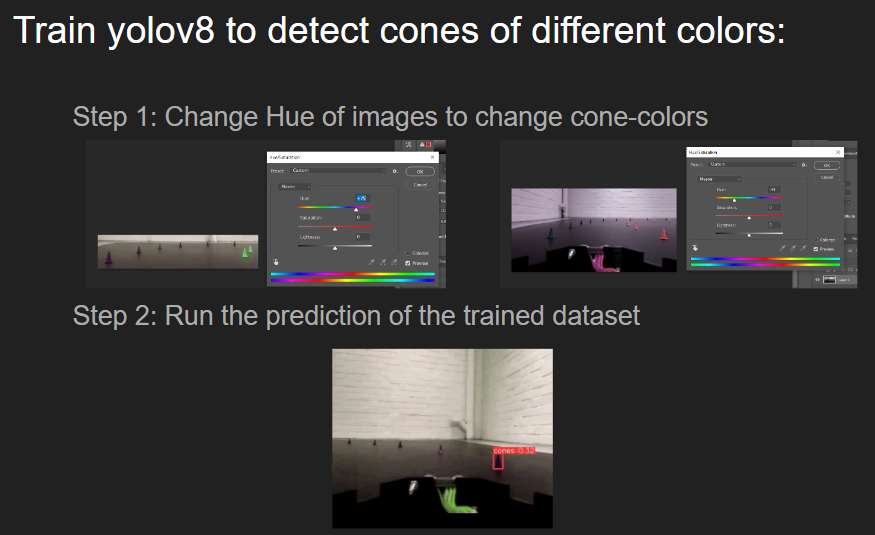

# Cyber Physical Systems and Sytems of Systems

In 2024, me and 3 other students were actively working this project from March to May. Due to our ambitious, we ventured on another project at the same time: [Project Branno](https://github.com/mrjex/Project-Branno). What's distinguishing for this project is its baseline similarity with the knowledge covered in this course. As we as students were given strict requirements and constraints in the development of this project, we couldn't include the ambitious extra features that we desired to add to the project. Thus, we ended up multitasking and developing a side project that's partially based on what you'll see in this very repository.

This course had a unique structure compared to all of my previous courses. Instead of having 3 major assignments, we had a total of 27 such that the required time for an assignment is significantly less. Moreover, the diffuculty of each assignment was fluctuating in the sense that the next task is predicated on the knowledge you were expected to derive from the previous task. For the sake of presenting me and my group's work in as simple a way as possible, I merged several assignments into one to reduce the quantity of folders. These assignments were categorized by 'Individual' and 'Group', such that the individual ones only applied to me, and the other ones involved the entire group. The vast majority of these were group assignments and the result of these can be found in the `/project` directory. However, I've put my individual tasks in the `/individual-assignments` folder. My previous *C* and *C++* experiences can be seen in:

- [Problem Solving, C-Programming](https://github.com/mrjex/C-Programming)

- [WioPlay](https://github.com/Indomet/WioPlay)

- [Development of Embedded & Real-Time Systems](https://github.com/mrjex/Embedded-and-Real-Time-Systems)

## Get Started

1. Run frontend docker container:

`docker run --rm -i --init --name=opendlv-vehicle-view -v $PWD:/opt/vehicle-view/recordings -v /var/run/docker.sock:/var/run/docker.sock -p 8081:8081 chrberger/opendlv-vehicle-view:v0.0.64`

2. Build h264-decoder docker image:

`docker build https://github.com/chalmers-revere/opendlv-video-h264-decoder.git#v0.0.5 -f Dockerfile -t h264decoder:v0.0.5`

3. Run h264-decoder container:

`xhost + docker run --rm -ti --net=host -e DISPLAY=$DISPLAY -v /tmp:/tmp h264decoder:v0.0.5 --cid=253 --name=img --verbose`

4. Compile CMAKE and MAKE dependencies of the C++ project:

`./project/scripts/dev-debug/compile.sh`

5. Run this project:

When running this project, you have two alternatives:

**Run local application:** Running your local code is straight forward. The only thing you need to worry about is the CMAKE and MAKE dependencies of the C++ code

1. `./project/scripts/dev-debug/run.sh`

**Run docker container:** Running the project through docker requires you to build a new docker image to account for your new modifications and then run that container

1. `docker build -f Dockerfile -t my-application`

2. `docker run --rm -ti --net=host --ipc=host -e DISPLAY=$DISPLAY -v /tmp:/tmp my-application:latest --cid=253 --name=img --width=640 --height=480 --verbose`

## Modifying Code

To modify the project, as a software engineer, there are a few things to keep in mind:

**Linux:** A linux operating system environment is required. If you have a Mac or Windows you have two options:

1. Use WSL command-line-interface

2. Download Virtualbox and interact through its provided user interface

**Shell Scripts:** There are quite a few `.sh` files assocaited to this project. All of them exists to serve the developers by saving them from tedious and repetitive tasks in debugging processes. Thus, you're encouraged to briefly glance over the existing scripts prior to modifying anything for the sake of simplyfying your prospective efforts.

**CI/CD:** The concerted efforts of optimizing the DevOps automated cycle of new features to feedback can bring you as a new developer a lot of insight on your implemented features. In each remote commit to the repository, the accuracy of the new algorithm is tested against the expected one. On top of that, the results are visualized. Further down the road, we identified the need for comparing the performance of your new commit to previous ones, which were our motive to incorporate the functionality of reverting to the previous commit, building a docker image, and running it on all 5 of the videos, which then are visualized. And this is repeated for the newly added functionality of the most recent commit as well.

**Multi-Architecture Support:** Through `buildx` we are able to support the two main architectures: `X86` and `ARM`. This is worth noting, since we in the beginning supported other architectures such as `390s` and `pp64`. However, these were hard to integrate with the C++ OpenCV library

## CI/CD

Continious Integration or Continious Deployment is a vital aspect of software engineering that has emerged in the last decades as a result of the need the necessity of automating the process of testing and monitoring the new changes comitted to a project. This is part of the efficiency and delivery of a team, as developers tend to make mistakes and have a hard time identifying them. Having a tool or a procedure that takes care of this, which then enables us to spot the errors earlier, allows us to save a tremendous amount of time. To incorporate the DevOps aspect in this project, we opted for a 3-staged pipeline:

## Accuracy

- We realized that it was imperative to be able to measure the success of our approaches
- The first thing we did was to develop tests to validate and display the accuracy of our solutions

### Customized Tests

- We as students were tasked with achieving a certain accuracy across 5 given `.rec` files (check `project/Videos`)

- For a frame to be considered correct, our calculated groundSteering value had to be within the range of 25% of the actual value. In other words, if the expected value is 0.23, the allowed range is

- UPPER BOUND: 0.23 + (0.23 * 0.25) = 0.2875
- LOWER BOUND: 0.23 - (0.23 * 0.25) = 0.1725

- We ended up plotting the graph of the expected vs actual as well, to gain a deeper insight of our result and how it differantiates from the optimal case:

- In later stages of the project, we retrieved the other values generated from the .rec files besides the groundSteering, such as A, B and C. These were then stored as CSV files and plotted as separate PNG files. In the long run, this manual process was time consuming and tedious. We realized that the time we used for this repetitive work could be used for more creative endeavors, so we automated this with a few Bash scripts:

### Cone Detection

Before we could start coding the algorithm, we were obligated to solve this part first. Just as we had to develop customized tests prior to the algorithm, we had to detect the cones and store their identified positions in CSV files, since this data constitute the input of the algorithm. By virtue of the large problem space, we were easily misleaded by the massive amount of information available on the internet that were related to our potential solutions. Thus, we ended up researching and trying many different approaches to this:

**Yolov8 Machine Learning**: We annotated images of frames of the video such that the detected or highlighted objects to focus on are the cones:

Eventually, we got curious and put the model's consistency to the test by annotating different colors of the cones. As we only were given 5 .rec files with consistent colors by our stakeholder, we changed the hue of the videos first:

1. Change hue:

2. Run prediction:

**HSV**: We used the OpenCV library of C++ to filter the fixed colors of the cones

In the end, we successfully got both approaches to work. However, the yolov8 solution was significantly harder to integrate to the system, since it takes a video and writes to a CSV at one go, whereas our system was intended to retrieve the data in real-time. Conceptually, this is possible to integrate, but it does require more time. We argued about the pros and cons about the solution we had in mind:

**Interruptive Shell Script**: Through a shell script that is invoked in the execution of the yolov8 model, we could manipulate the dataflow with commands. In a repetitive fashion, we could call a shell-command for each and get the data of the latest row in the CSV file, and then run the algorithm on only this row. Hence, the system would still be able to satisfy the pre-requirement of generate the data in real-time.

Due to the constrained time of this course, we opted for the HSV implementation. Since we already were familiar with OpenCV and C++ at this point, this was the most convenient approach in the context of this project.

### Algorithm

Now, once our tests were successfully working and providing us as developers a comprehesive picture of what our work objectively achieves in relative to the predefined requirements of this project, we directed our focus on coming up with the actual solutions. As for the backen algorithm, the first thing that came to our minds was using trigonometry, since at this stage of the project we had

- the car is always at the center of the screen of the videos, meaning that it's pixel-position is fixed
- Pythagaros theorem

#### Trigonometry

Initial intuition:

The group’s initial algorithmic attempt was to use the positions of the cones to determine the diagonal and horizontal distance from the car’s center. In turn, we could draw rectangles and resolve the associated angles to ultimately decide how close a cone is, and hence, how intense the car had to steer. This would be done by using Pythagoras Theorem to calculate the length of the sides combined with tan inverse to resolve the angles. In the picture below, the car is driving in an intense curve, resulting in the blue cones being unnoticed:

In this case, the magnitude of the angle separating the yellow cone and the center of the car would define the degree to which the car would turn in the opposite direction. If the angle is bigger, it implies that the cone is further away, making the calculated ground steering value less significant. Conversely, a close cone would yield a small angle, but generate a steering value that reflects a strong curve. This is implemented by working with the angles within a range from 0 to 180, where 0 is equivalent to a sharp 90-degree turn to the left, 180 is a 90-degree turn to the right, and 90 is the central angle, indicating that the car is driving in a straight line4. In the implementation, we would either subtract or add the calculated angle from the central angle, depending on whether a left or right cone was detected However, in case of slighter turns where cones at both sides are present, we needed to take into account for the degree of each angle and establish a mathematical algebraic relationship that gives precedence to the closest cone, yet still lets the cone in the back have an impact on the outputted steering angle. We expressed this relationship by taking the average of the absolute values of each angle from the central angle 90:

Once we reached the disappointing result of only achieving an accuracy of 12%, the graph was plotted such that the blue line is our output compared to the actual ground steering:

When weobserved the blue line, it appeared as if it turned more on the easier curves but failed to match the magnitude of the expected intensity in the harder curves. Due to this, we developed the hypothesis that the algorithm worked as intended, in the sense that if it would be applied on the car it would stay within the road and avoid crashing. We reasoned that if the sum of the generated ground-steering values would be equal, meaning that both algorithms make the car turn the same number of degrees in the same video, then our algorithm must work as intended, despite the disappointing accuracy:

Keep in mind that a human drives the car in the video. This would undoubtedly entail a higher inaccuracy, as opposed to running a simulation with the car on the implemented algorithm. For instance, if the human drives too deep in a curve, our algorithm encounters a case it never should encounter (because it would turn significantly earlier) with respect to the positions and angles to the detected cones. Below follows a visualization of how our algorithm differs from the expected value, where the red line represents the calculated value:

The question that remains now is: Now when we have mathematical proof that the algorithm is capable of steering the car on the cone road without crashing, why did it only reach an accuracy of 12%? First of all, as mentioned above the fact that the car is running on a human-driven video exposes it in scenarios it never would reach if our algorithm was applied, resulting in erroneous cone-angles (input) and thus inaccurate ground steering (output). The second contributing factor is concerned with the requirement of staying within 25% of the expected output. To put this in perspective, let's observe the numerical constraints in two concrete cases:

The two cases above convey that the difference is significant yet not too distant for it to be dismissed when the algorithm operates with erroneous input (a fixed video without a real-time simulation of the applied algorithm’s performance). In other words, when the two factors are coupled together, the 25% requirement doesn’t make up for the fact that the input video is pre-recorded. Ultimately, we concluded that applying this trigonometric algorithm to the car would correctly drive it as in avoiding crashing into cones. We also acknowledged that this approach wouldn’t yield a satisfactory result with respect to the set-out requirements of this course as we moved on to the next algorithmic attempt, linear regression.

#### Linear Regression

After noticing that the car was providing periodic data, we decided to run statistical analyses using Jasp2 to find potential correlations between the different values. It was apparent in our findings that the angular velocity as well as the infra-red readings had a significant effect on the value of the steering angle, this was clear to us after noticing a p-value lower than 0.05. As the velocity increased, the steering angle would increase. In addition, as the distance from the car to the cone increased, the steering angle also increased. These results pointed us in the right direction and allowed us to create the following formula:

**Steering Angle = (abs(velocity) * 0.002) + (1 / (abs(distanceFromCone) * 10))**

With this formula, we were able to go from 17% accuracy on the best video to 26% accuracy on the worst video and 32% accuracy on the best video. The data is extracted on the go using the capabilities of the cluon library, the algorithm accepts the current angular velocity, and the infra-red readings as an input and produces the steering angle as an output. The last part of the algorithm involves determining the direction in which the car is supposed to be traveling. In order to achieve this, the algorithm keeps track of which cone color was last seen on the left/right side of the road which allows it to compute the correct steering angle direction on every timestamp.

