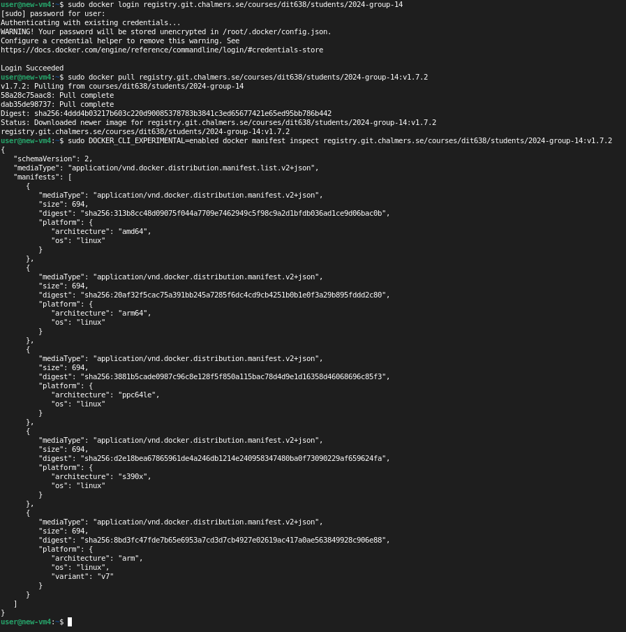
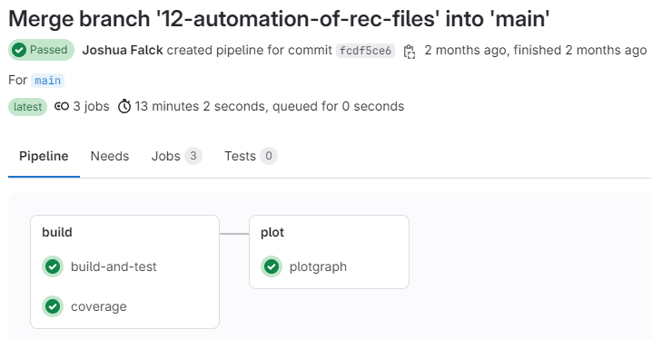
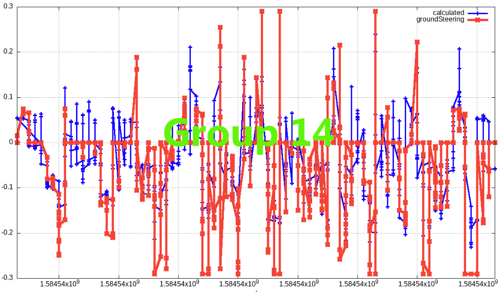
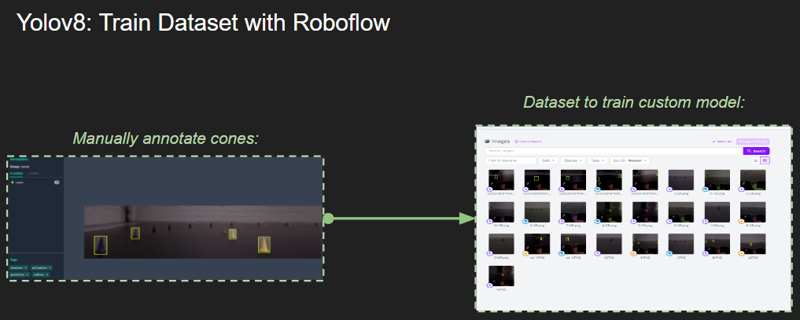
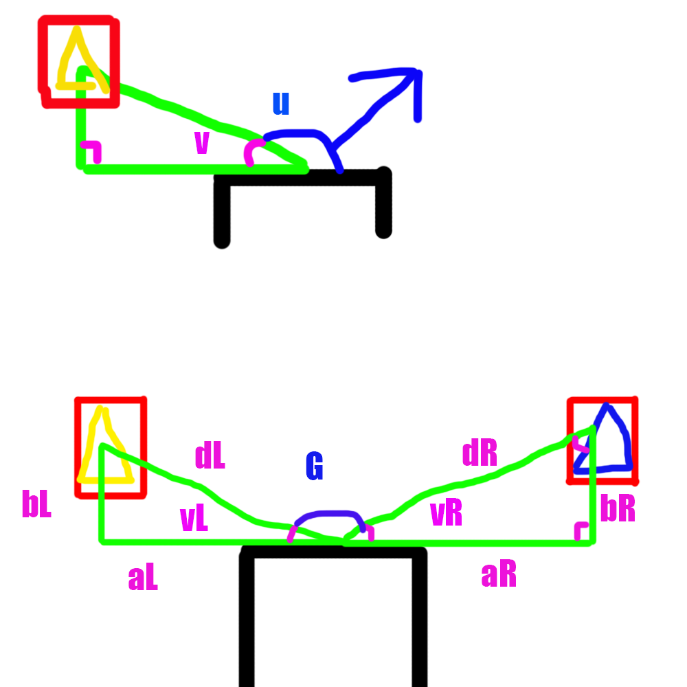

# 🚗 Cyber Physical Systems and Systems of Systems

> Advanced autonomous driving system using computer vision and real-time processing by Joel Mattsson, Mohamad Khalil, Joshua Falck and Joey Karlsson


[](https://en.cppreference.com/w/)
[](https://opencv.org/)
[](https://www.docker.com/)
[](https://github.com/ultralytics/ultralytics)
[](https://github.com/mrjex/Cyber-Physical-Systems-and-Sytems-of-Systems)


## Table of Contents
- [🚗 Cyber Physical Systems and Systems of Systems](#-cyber-physical-systems-and-systems-of-systems)
  - [Table of Contents](#table-of-contents)
  - [Overview](#overview)
  - [Getting Started](#getting-started)
    - [Required Tools](#required-tools)
    - [Clone And Build](#clone-and-build)
    - [Run containers](#run-containers)
  - [🔧 Modifying Code](#-modifying-code)
    - [Environment Requirements](#environment-requirements)
    - [Development Tools](#development-tools)
  - [CI/CD Pipeline](#cicd-pipeline)
  - [Accuracy Testing](#accuracy-testing)
    - [Testing Methodology](#testing-methodology)
    - [Visualization Tools](#visualization-tools)
    - [Automated Analysis](#automated-analysis)
  - [Cone Detection](#cone-detection)
    - [YOLOv8 Machine Learning](#yolov8-machine-learning)
    - [HSV Color Filtering](#hsv-color-filtering)
  - [Algorithm Development](#algorithm-development)
    - [Trigonometry Approach](#trigonometry-approach)
    - [Linear Regression Approach](#linear-regression-approach)


## Overview

From March to May 2024, our team of four students developed this autonomous driving system as part of our coursework. The project implements computer vision techniques for cone detection and steering algorithms for autonomous navigation.

Due to course constraints limiting certain ambitious features, we simultaneously developed [Project Branno](https://github.com/mrjex/Project-Branno), which extends the concepts explored here.

Unlike traditional course structures, this project consisted of 27 smaller assignments with increasing complexity, building upon knowledge from previous tasks. For simplicity, I've merged related assignments into logical groups in this repository:
- `root directory`: Group project
- `/individual-assignments`: My personal contributions


## Getting Started


### Required Tools
These are the tools that are required to build the project, ensure that they are present on your system by running the following commands and getting a valid output.
```
g++ --version
make --version
cmake --version
git --version
```

### Clone And Build
These are the steps to build the project

```
git clone https://github.com/mrjex/Cyber-Physical-Systems-and-Sytems-of-Systems.git
mkdir build (inside the cloned directory)
cd build
cmake ..
make
```


### Run containers


1. **Run frontend docker container**
   ```bash
   docker run --rm -i --init --name=opendlv-vehicle-view -v $PWD:/opt/vehicle-view/recordings -v /var/run/docker.sock:/var/run/docker.sock -p 8081:8081 chrberger/opendlv-vehicle-view:v0.0.64
   ```

2. **Build h264-decoder docker image**
   ```bash
   docker build https://github.com/chalmers-revere/opendlv-video-h264-decoder.git#v0.0.5 -f Dockerfile -t h264decoder:v0.0.5
   ```

3. **Run h264-decoder container**
   ```bash
   xhost + docker run --rm -ti --net=host -e DISPLAY=$DISPLAY -v /tmp:/tmp h264decoder:v0.0.5 --cid=253 --name=img --verbose
   ```

4. **Compile C++ dependencies**
   ```bash
   ./project/scripts/dev-debug/compile.sh
   ```

5. **Run the project**
   
   *Option 1: Local execution*
   ```bash
   ./project/scripts/dev-debug/run.sh
   ```
   
   *Option 2: Docker container*
   ```bash
   docker build -f Dockerfile -t my-application
   docker run --rm -ti --net=host --ipc=host -e DISPLAY=$DISPLAY -v /tmp:/tmp my-application:latest --cid=253 --name=img --width=640 --height=480 --verbose
   ```

## 🔧 Modifying Code

### Environment Requirements
- **Linux** environment (options for non-Linux users):
  - WSL command-line interface
  - VirtualBox with GUI

### Development Tools
- **Shell Scripts**: Explore existing `.sh` files to simplify debugging processes
- **Multi-Architecture Support**: Support for both `X86` and `ARM` architectures through `buildx`



## CI/CD Pipeline

Our 3-stage DevOps pipeline automates testing and visualization of algorithm performance:



Benefits:
- Early error detection
- Automatic comparison with previous versions
- Performance visualization across all test videos
- Support for multiple architectures

## Accuracy Testing

### Testing Methodology
- Performance measured across 5 test videos (see `project/Videos`)
- Frame accuracy criteria: calculated steering value within ±25% of ground truth
  - Example: For expected value 0.23, acceptable range is 0.1725-0.2875

### Visualization Tools

[](https://www.youtube.com/watch?v=2nMf8ZPoyLo)
*Video: Custom test visualization*

Our testing framework includes:
- Expected vs. actual value comparison
- Performance graphs for visual analysis
- Automated test result generation


*Performance comparison visualization*

### Automated Analysis

We developed shell scripts to automate the testing process:

[](https://www.youtube.com/watch?v=WRlhP645xCw)
*Video: Automated test analysis*

[](https://www.youtube.com/watch?v=B3PC6q6PbXQ)
*Video: Shell-based graph generation*

## Cone Detection

Before implementing steering algorithms, we needed reliable cone detection. We explored two approaches:

### YOLOv8 Machine Learning
- Manually annotated frames to train the model for cone detection
- Tested model robustness with hue-shifted videos


*YOLOv8 training with annotated images*

[](https://www.youtube.com/watch?v=z00Hh8TTxKY)
*Video: YOLOv8 cone detection*

[](https://www.youtube.com/watch?v=5p3Kr_2tf9E)
*Video: Testing with color variation*

### HSV Color Filtering
- Used OpenCV's HSV color filtering for real-time detection
- More easily integrated with the existing system architecture

Implementation challenges:
- YOLOv8 required additional integration work for real-time processing
- HSV approach offered simpler integration with existing C++ codebase

## Algorithm Development

### Trigonometry Approach

Our initial algorithm used basic trigonometry:
- Calculate distance and angle to detected cones
- Adjust steering based on proximity and angle to cones
- Weightings applied to give precedence to closest cones


*Initial algorithm concept sketch*

Implementation details:
- Angles calculated from 0-180° (0=hard left, 90=straight, 180=hard right)
- Weighting system for multiple cone detection
- Proximity-based steering intensity

Performance analysis:
- Achieved only 12% accuracy against recordings
- Further analysis revealed potential viability in real scenarios


*Trigonometry algorithm performance visualization*

[](https://www.youtube.com/watch?v=ZwcRwJHVj1w)
*Video: Ground steering visualization*

[](https://www.youtube.com/watch?v=Q6-Qr963974)
*Video: Driving line visualization*

### Linear Regression Approach

Statistical analysis revealed correlations between sensor data and steering angles:
- Angular velocity positively correlated with steering angle
- Distance to cones inversely correlated with steering angle

Our improved formula:
Steering Angle = (abs(velocity) * 0.002) + (1 / (abs(distanceFromCone) * 10))

Performance improvements:
- Accuracy increased from 17% to 26-32% across test videos
- Direction determination based on cone color position tracking


*Linear regression algorithm visualization*


---

*Developed with by Joel Mattsson, Mohamad Khalil, Joshua Falck and Joey Karlsson*